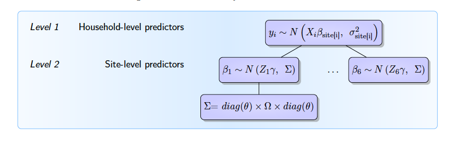

### Bayesian hierarchical analysis of a multifaceted program against extreme poverty

The preprint of my analysis is available at [this link](https://arxiv.org/abs/2109.06759)!

**Abstract:**

The evaluation of a multifaceted program against extreme poverty in different developing countries gave encouraging results, but with important heterogeneity between countries. This master thesis proposes to study this heterogeneity with a Bayesian hierarchical analysis. The analysis we carry out with two different hierarchical models leads to a very low amount of pooling of information between countries, indicating that this observed heterogeneity should be interpreted mostly as true heterogeneity, and not as sampling error. We analyze the first order behavior of our hierarchical models, in order to understand what leads to this very low amount of pooling. We try to give to this work a didactic approach, with an introduction of Bayesian analysis and an explanation of the different modeling and computational choices of our analysis.

**R and Stan code:**

You can find the code of this Bayesian analysis [in the Code folder](https://github.com/louischarlot/Bayesian_hierarchical_analysis_multifaceted_program_extreme_poverty/tree/master/Code).

In particular:

- Our **first hierarchical model** is built in [this Stan file](./Code/Model_1.stan) and run in [this R file](./Code/Model_1.R).

- Our **second hierarchical model** is built in [this Stan file](./Code/Model_2.stan) and run **without baseline values** in [this R file](./Code/Model_2_baseline.R) and **with baseline valiues** in [this R file](./Code/Model_2_no_baseline.R).

